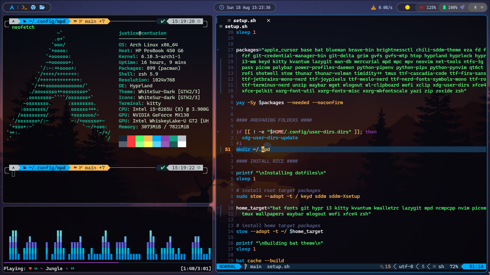

# My dotfiles



## Installation

```bash
git clone https://github.com/justicenyaga/.dotfiles ~/.dotfiles
cd ~/.dotfiles
chmod +x setup.sh
./setup.sh
```

## ZSH setup

### Switch to zsh

```bash
zsh
```

### Install oh-my-zsh

```bash
sh -c "$(curl -fsSL https://raw.github.com/robbyrussell/oh-my-zsh/master/tools/install.sh)"
```

### Install powerlevel10k

```bash
git clone https://github.com/romkatv/powerlevel10k.git $ZSH_CUSTOM/themes/powerlevel10k
```

### Install zsh-syntax-highlighting

```bash
git clone https://github.com/zsh-users/zsh-syntax-highlighting.git ${ZSH_CUSTOM:-~/.oh-my-zsh/custom}/plugins/zsh-syntax-highlighting
```

### Install zsh-autosuggestions

```bash
git clone https://github.com/zsh-users/zsh-autosuggestions ${ZSH_CUSTOM:-~/.oh-my-zsh/custom}/plugins/zsh-autosuggestions
```
